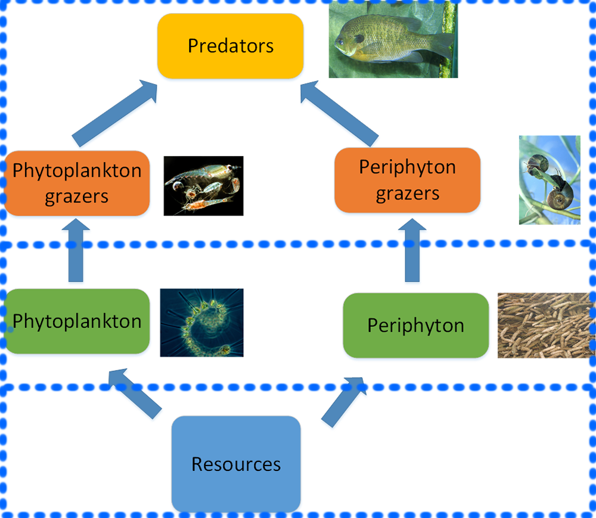

Food Web Model
==============

A food web model of the aquatic species of the Lake George, NY, USA.
--------------------------------------------------------------------

This is a food web model on the biomass dynamics of different aquatic species at
Lake George, NY, USA. This food web model interfaces with a geophysical model on
water dynamics, sedimentation light incidence, temperature and other abiotic
metrics developed by the IBM team at **IBM Thomas J. Watson Research Center**,
in Yorktown Heights, NY, USA.

The model predicts the spatio-temporal distribution of the biomass of multiple
species, including:

-   Phytoplankton

-   Periphyton

-   Zooplankton and other grazers

-   Fish, insects and other predators.

The food web modeled is illustrated in the following figure:

